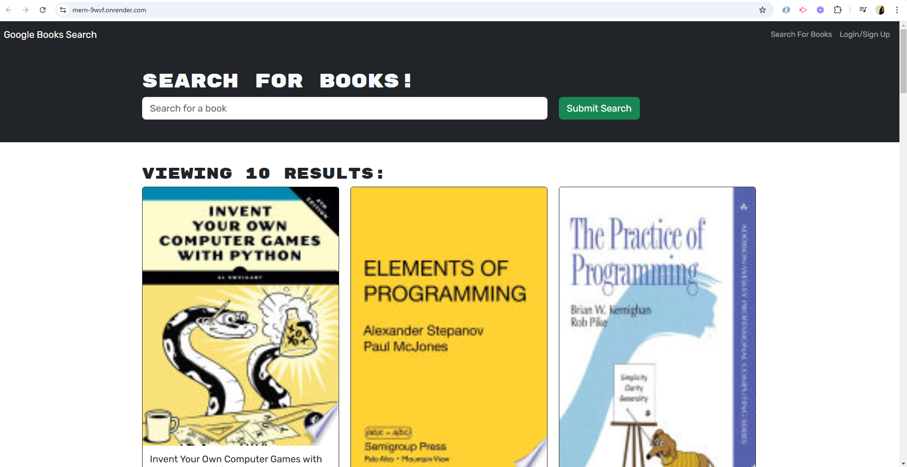

# MERN PROJECT

## Description
This project was originally built using fetch requests for data handling. My responsibility was to refactor the project to use the MERN stack with GraphQL, Apollo, and mutations. Both the client and server parts of the application were updated to incorporate these technologies.

## Technologies Used
- MongoDB
- Express.js
- React.js
- Node.js
- GraphQL
- Apollo Client/Server

## Features
- Refactored data fetching to use GraphQL queries and mutations
- Integrated Apollo Client on the frontend for state management
- Set up Apollo Server on the backend to handle GraphQL requests
- Updated MongoDB models and Express routes to work with GraphQL

## Installation
1. Clone the repository
    ```bash
    git clone hhttps://github.com/laristizabal02/MERN.git
    ```
2. Navigate to the project directory
    ```bash
    cd your-repo
    ```
3. Install dependencies
    ```bash
    npm install
    ```
4. Build the project
    ```bash
    npm run build
    ```
5. Start the development server
    ```bash
    npm run develop
    ```

## Usage
1. Start the server and client
    ```bash
    npm run develop
    ```



## Contributing
Pull requests are welcome. For major changes, please open an issue first to discuss what you would like to change.
Github: https://github.com/laristizabal02/MERN
Deploy app: https://mern-9wvf.onrender.com/

## License
[MIT](https://choosealicense.com/licenses/mit/)
